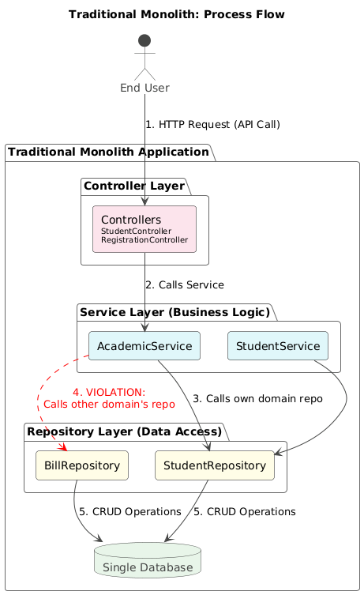

# University System - Traditional Monolith

Traditional Monolith: Process Flow
This diagram illustrates how a user request flows through the different technical layers of the traditional monolith application. It specifically highlights the tight coupling within the service layer, where services often directly access the repositories of different domains, creating a "Big Ball of Mud."



Consequences of This Approach:
- Tight Coupling: AcademicService "knows too much" about the implementation details of the Finance module (the Bill table) and the Student Affairs module (the Student table).
- Ripple Effect: If the Finance team changes how outstanding payments are checked (e.g., by renaming the Bill table), the code in AcademicService will break. The Academics team's work is disrupted.
- Hard to Understand: A new developer must understand the entire system to change even a small feature.

## Project Structure

The project follows a traditional monolithic architecture with clear separation of concerns.


The system is organized into the following components:
- Controllers: Handle HTTP requests and responses
- Services: Contain business logic
- Repositories: Manage data access
- Entities: Represent database models
- DTOs: Transfer data between layers
- Exceptions: Handle error cases

## Main Features

- Student management
- Course registration
- Academic services
- Notification system
- Billing and payment tracking

## Technology Stack

- Java 21
- Spring Boot 3
- Spring Data JPA
- Maven 3

## Running the Application

To run the application:

1. Clone the repository
2. Navigate to the project directory
3. Run the application using Maven:
   ```
   ./mvnw spring-boot:run
   ```
   or
   ```
   mvn spring-boot:run
   ```
4. The application will start on port 8081

## Accessing Swagger UI

The API documentation is available through Swagger UI:

1. Start the application
2. Open your browser and navigate to:
   ```
   http://localhost:8081/swagger-ui.html
   ```
3. You can explore and test all available endpoints through the Swagger interface

## Accessing H2 Database Console

The application uses an in-memory H2 database that can be accessed through a web console:

1. Start the application
2. Open your browser and navigate to:
   ```
   http://localhost:8081/h2-console
   ```
3. Use the following connection details:
   - JDBC URL: `jdbc:h2:mem:university-monolith`
   - Username: `sa`
   - Password: (leave empty)
   - Driver Class: `org.h2.Driver`
4. Click "Connect" to access the database
