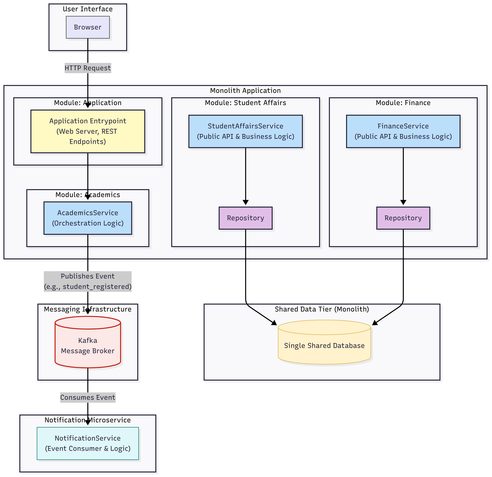

# University System

A comprehensive university management system built with Spring Boot, designed to handle various aspects of university operations including student affairs, academics, finance, and notifications.

## Modular Monolith Architecture

This project implements a modular monolith architecture, which combines the simplicity of monolithic deployment with the maintainability of a modular codebase:

- **Single Deployment Unit**: The entire application is deployed as a single unit, simplifying operations and deployment processes
- **Modular Code Organization**: Code is organized into separate modules with clear boundaries
- **Internal Module Independence**: Each module has its own domain model, services, and APIs
- **Explicit Module Dependencies**: Dependencies between modules are explicitly defined in the POM files
- **Shared Database**: All modules share a single database but maintain their own tables and schemas

This approach offers several benefits:
- Simplified deployment and operations compared to microservices
- Clear code organization and separation of concerns
- Ability to evolve modules independently
- Easier refactoring and maintenance
- Potential future migration path to microservices if needed

## System Architecture

The system primarily follows a **Modular Monolith** architecture, with the addition of a separate **Notifications Microservice**:



## Modules

### Modular Monolith Components
- **Application**: Main application module that bootstraps the entire system
- **Student Affairs**: Manages student records and information
- **Academics**: Handles course registration and academic operations
- **Finance**: Manages billing and payment processing

### Microservices
- **Notifications Service**: Standalone microservice that handles system notifications and alerts. This module has been migrated from the monolith to a separate microservice. Communication between the university application and the notifications service is implemented using Kafka messaging.


## Technologies Used

- Java 21
- Spring Boot 3
- Spring Data JPA
- H2 Database (in-memory)
- Swagger/OpenAPI for API documentation
- Docker and Docker Compose for containerization
- Apache Kafka for messaging between services
- Spring Cloud Stream for Kafka integration

## Inter-Service Communication

The university application communicates with the Notifications Service microservice using Apache Kafka:

1. **Producer (University App)**: The main application uses `KafkaNotificationService` with Spring Cloud Stream's `StreamBridge` to send notification events to a Kafka topic.
2. **Consumer (Notifications Service)**: The notifications microservice uses a Spring Cloud Stream consumer function to receive notification events from the Kafka topic and process them.

This asynchronous messaging pattern allows for:
- Decoupling of services
- Reliable message delivery
- Scalable processing of notifications
- Fault tolerance

## Setup and Installation

### Prerequisites

- Java 21 or higher
- Maven 3.6 or higher

### Building the Project

```bash
mvn clean install
```

### Running the Application

```bash
mvn spring-boot:run -pl application
```

## API Documentation

### Swagger UI

The API documentation is available via Swagger UI at:

```
http://localhost:8080/swagger-ui.html
```

### Available Endpoints

#### Student Affairs

- **Create Student**
  - Endpoint: `POST /api/students`
  - Description: Creates a new student record
  - Sample Request:
    ```bash
    curl -X POST http://localhost:8080/api/students \
      -H "Content-Type: application/json" \
      -d '{
        "name": "John Doe",
        "email": "john.doe@example.com",
        "active": true
      }'
    ```

#### Academics

- **Register for Courses**
  - Endpoint: `POST /api/registration`
  - Description: Registers a student for courses
  - Sample Request:
    ```bash
    curl -X POST http://localhost:8080/api/registration \
      -H "Content-Type: application/json" \
      -d '{
        "studentId": 1,
        "courseIds": [101, 102, 103]
      }'
    ```

## Database Access

The application uses an H2 in-memory database. You can access the H2 console at:

```
http://localhost:8080/h2-console
```

Connection details:
- JDBC URL: `jdbc:h2:mem:university`
- Username: `sa`
- Password: (leave empty)

## Error Handling

The system includes centralized error handling for common exceptions:

- `StudentNotFoundException`: Returns 404 Not Found
- `StudentNotActiveException`: Returns 403 Forbidden
- `OutstandingPaymentsException`: Returns 403 Forbidden

## Docker Deployment

The system can be deployed using Docker Compose, which sets up all necessary services including the main application, notifications microservice, Kafka, and monitoring tools.

### Prerequisites

- Docker and Docker Compose installed on your machine
- Java 21 and Maven installed for building the application

### Components

The Docker Compose configuration includes the following services:

1. **university-app**: The main modular monolith application
2. **notifications-service**: The standalone notifications microservice
3. **zookeeper**: Required for Kafka
4. **kafka**: The message broker used for communication between services
5. **kafka-ui**: A UI for monitoring Kafka

### Building and Running

```bash
# Build the application JARs
mvn clean package

# Start all services
docker-compose up -d

# Stop all services
docker-compose down
```

### Accessing the Services

- Main Application: http://localhost:8080
- H2 Console: http://localhost:8080/h2-console
- Notifications Service: http://localhost:8081
- Kafka UI: http://localhost:8082

### Environment Variables

The Docker Compose file sets the following environment variables:

#### university-app
- SPRING_DATASOURCE_URL=jdbc:h2:mem:university
- SPRING_DATASOURCE_USERNAME=sa
- SPRING_DATASOURCE_PASSWORD=
- SPRING_CLOUD_STREAM_KAFKA_BINDER_BROKERS=kafka:9092
- SPRING_H2_CONSOLE_SETTINGS_WEB_ALLOW_OTHERS=true

#### notifications-service
- SERVER_PORT=8081
- SPRING_CLOUD_STREAM_KAFKA_BINDER_BROKERS=kafka:9092
- SPRING_CLOUD_STREAM_KAFKA_BINDER_AUTO_CREATE_TOPICS=true

### Troubleshooting

If you encounter any issues:

1. Check if all containers are running:
   ```bash
   docker-compose ps
   ```

2. Check the logs of a specific service:
   ```bash
   docker-compose logs university-app
   docker-compose logs notifications-service
   docker-compose logs kafka
   ```

3. Ensure that the JAR files exist in the expected locations:
   - ./application/target/application-0.0.1-SNAPSHOT.jar
   - ./notifications-service/target/notifications-service-0.0.1-SNAPSHOT.jar

4. For H2 Console access issues:
   - Make sure you're using the correct JDBC URL: jdbc:h2:mem:university
   - Username: sa
   - Password: (leave empty)
   - The H2 console is configured to allow remote connections with the SPRING_H2_CONSOLE_SETTINGS_WEB_ALLOW_OTHERS=true setting

5. For Kafka connection issues:
   - The Kafka broker is configured with two listeners:
     - PLAINTEXT://kafka:29092 for internal container communication
     - PLAINTEXT_HOST://localhost:9092 for external access
   - Services within Docker should use kafka:29092
   - Applications running on the host machine should use localhost:9092
